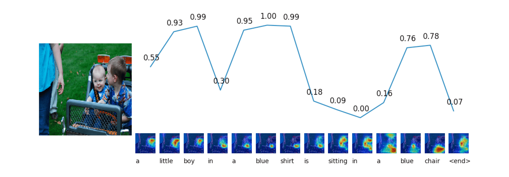
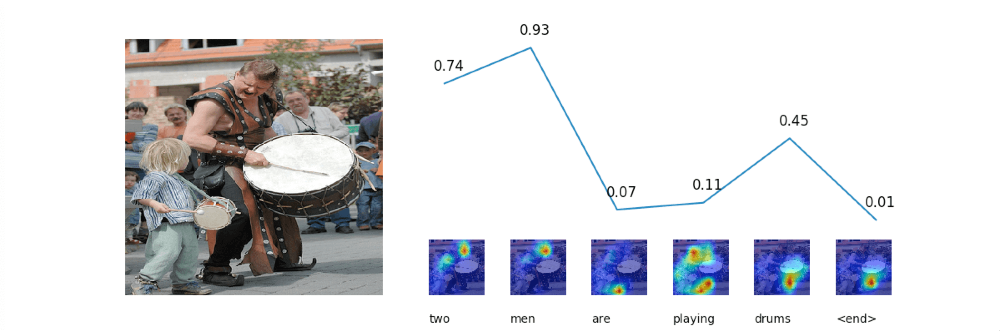
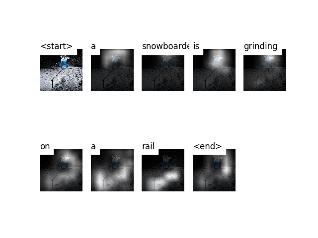
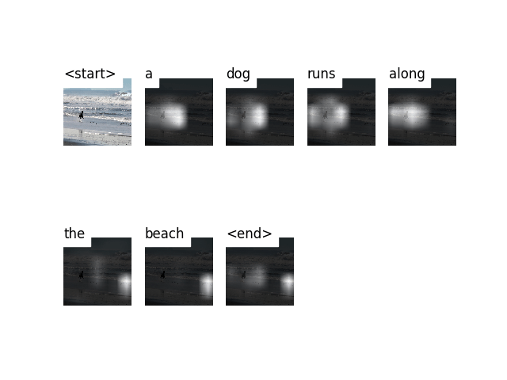
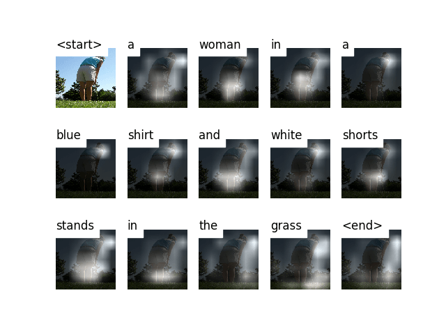

# Image Caption

Pytorch re-implementation of some image caption models. Based on [sgrvinod/a-PyTorch-Tutorial-to-Image-Captioning](https://github.com/sgrvinod/a-PyTorch-Tutorial-to-Image-Captioning), thanks for this great work.

&nbsp;
## Model List

- `show_tell`

    **Show and Tell: A Neural Image Caption Generator.** *Oriol Vinyals, et al.* CVPR 2015. [[Paper]](https://www.cv-foundation.org/openaccess/content_cvpr_2015/papers/Vinyals_Show_and_Tell_2015_CVPR_paper.pdf) [[Code]](https://github.com/tensorflow/models/tree/master/research/im2txt)

- `att2all`

    **Show, Attend and Tell: Neural Image Caption Generation with Visual Attention.** *Kelvin Xu, et al.* ICML 2015. [[Paper]](http://proceedings.mlr.press/v37/xuc15.pdf) [[Code]](https://github.com/kelvinxu/arctic-captions)


- `adaptive_att` & `spatial_att`

    **Knowing When to Look: Adaptive Attention via A Visual Sentinel for Image Captioning.** *Jiasen Lu, et al.* CVPR 2017. [[Paper]](http://openaccess.thecvf.com/content_cvpr_2017/papers/Lu_Knowing_When_to_CVPR_2017_paper.pdf) [[Code]](https://github.com/jiasenlu/AdaptiveAttention)

You can train different models by configure `caption_model` in  [`config.py`](config.py). I have also took some [notes](https://renovamen.ink/2020/03/17/image-caption-papers/) (Chinese) of the above mentioned models.

&nbsp;

## Environment

- Python 3.6.5
- Pytorch 1.4.0 (along with torchvision)

&nbsp;

## Dataset

For dataset, I use [Flicker8k](https://academictorrents.com/details/9dea07ba660a722ae1008c4c8afdd303b6f6e53b) and [Karpathy's split](http://cs.stanford.edu/people/karpathy/deepimagesent/caption_datasets.zip). It is also okey to use Flickr30k or MSCOCO (their splits and captions are also contained in Karpathy's split). If you want to use other datasets, you may should create a JSON file which looks like Karpathy's JSON.

&nbsp;

## Usage

### Configuration

Configure parameters in  [`config.py`](config.py). Refer to this file for more information about each config item.


### Preprocess

First of all, you should preprocess the images along with their captions and store them locally:

```bash
python preprocess.py
```


### Train

To train a model, just run:

```bash
python train.py
```

### Evaluation

Compute the BLEU-4 scores of a trained model on test set:

```bash
python eval.py
```

During training, the BLEU-4 scores on validation set will be computed after each epoch's validation. However, since the decoder's input at each timestep is the word in ground truth captions, but not the word it generated in the previous timestep (Teacher Forcing), such BLEU-4 scores does not reflect the real performance. So you can also consider about using this script to compute the correct BLEU-4 scores of a specific model on validation set.


### Inference

This is for when you have trained a model and want to generate a caption (and visualize the attention weights, if the model includes a attention network) for a specific image:

First modify following things in [`inference.py`](inference.py).:

```python
model_path = 'path_to_trained_model'
wordmap_path = 'path_to_word_map'
img = 'path_to_image'
beam_size = 5 # beam size for beam search
```

Then run:

```bash
python inference.py
```

&nbsp;
## Results

Here are some examples of the captions generated on images in test set.

### Adaptive Attention




### Attention



