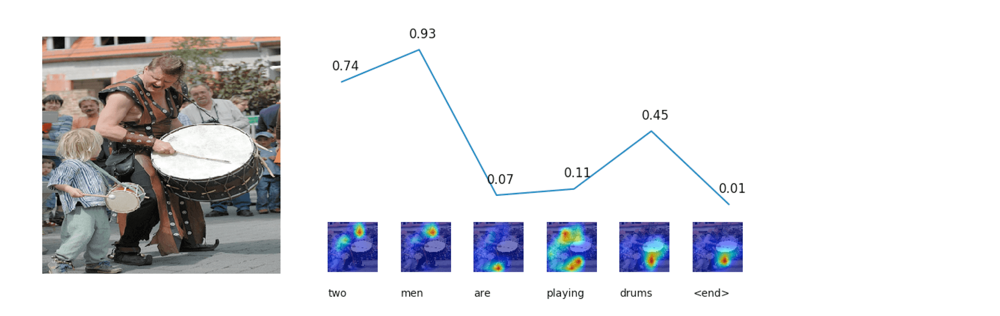
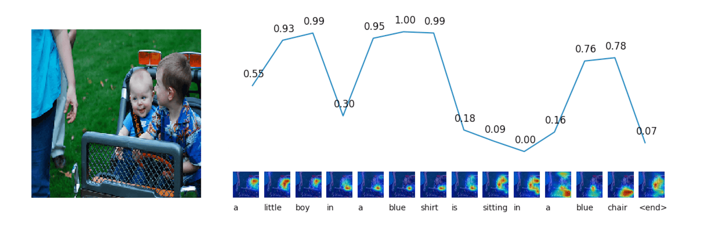
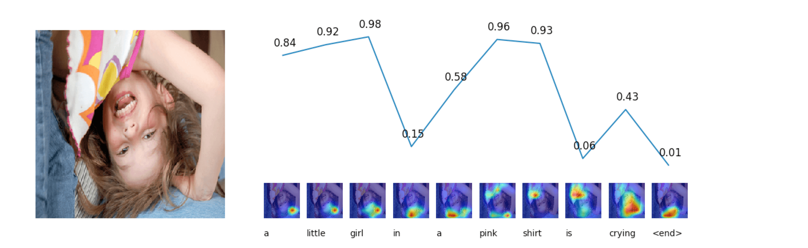
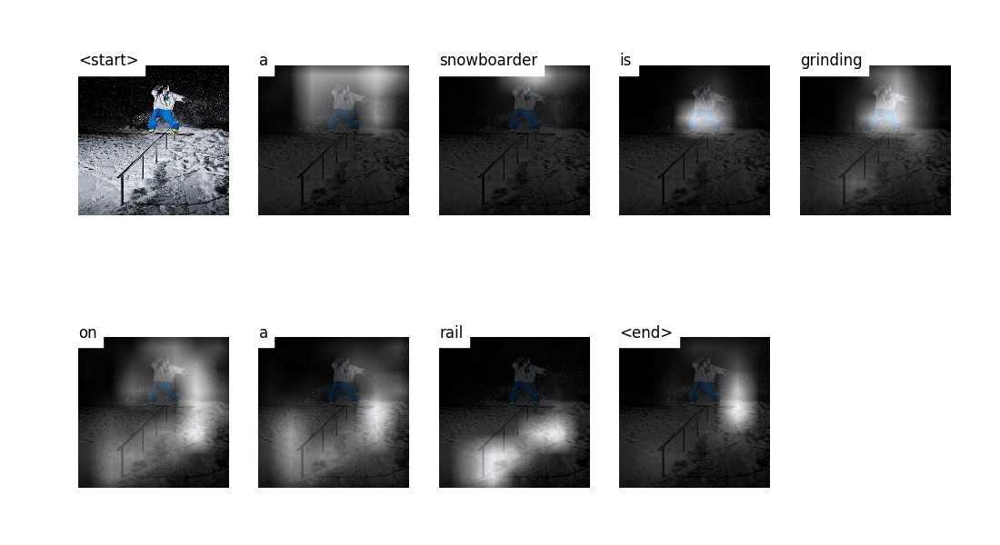
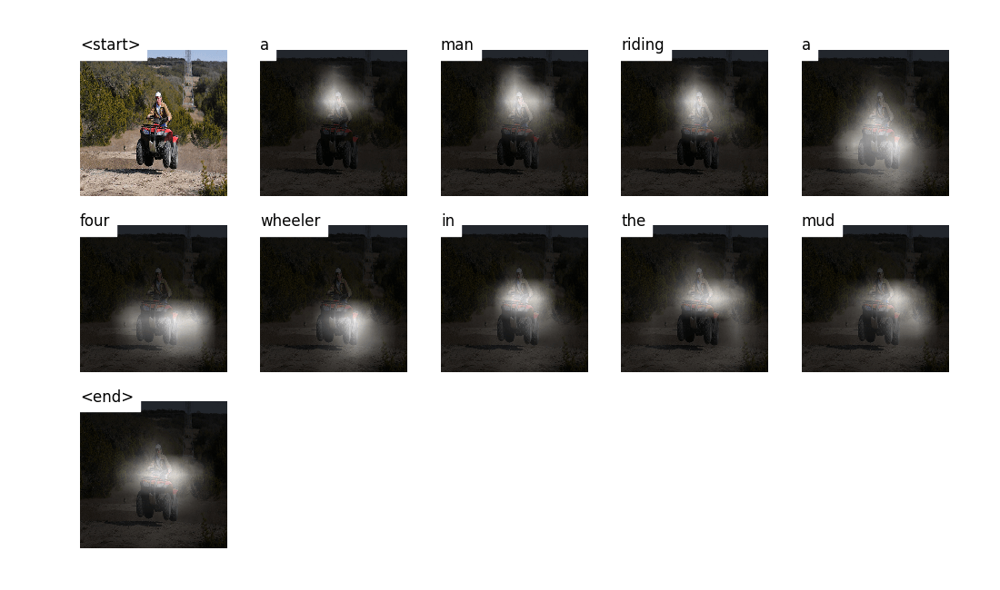
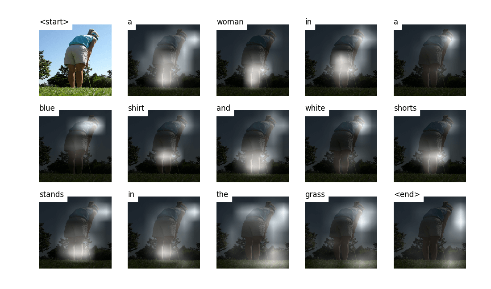
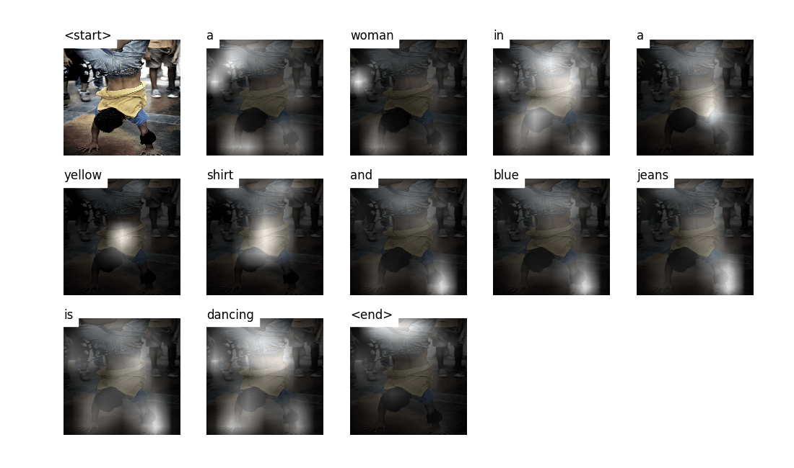

# Image Captioning

PyTorch re-implementation of some image captioning models.


&nbsp;

## Supported Models

- `show_tell`

    **Show and Tell: A Neural Image Caption Generator.** *Oriol Vinyals, et al.* CVPR 2015. [[Paper]](https://www.cv-foundation.org/openaccess/content_cvpr_2015/papers/Vinyals_Show_and_Tell_2015_CVPR_paper.pdf) [[Code]](https://github.com/tensorflow/models/tree/master/research/im2txt)

- `att2all`

    **Show, Attend and Tell: Neural Image Caption Generation with Visual Attention.** *Kelvin Xu, et al.* ICML 2015. [[Paper]](http://proceedings.mlr.press/v37/xuc15.pdf) [[Code]](https://github.com/kelvinxu/arctic-captions)


- `adaptive_att` & `spatial_att`

    **Knowing When to Look: Adaptive Attention via A Visual Sentinel for Image Captioning.** *Jiasen Lu, et al.* CVPR 2017. [[Paper]](http://openaccess.thecvf.com/content_cvpr_2017/papers/Lu_Knowing_When_to_CVPR_2017_paper.pdf) [[Code]](https://github.com/jiasenlu/AdaptiveAttention)

You can train different models by editing `caption_model` item in  [`config.py`](config.py).


&nbsp;

## Requirements

First, make sure your environment is installed with:

- Python >= 3.5
- java 1.8.0 (for computing METEOR)

Then install requirements:

```bash
pip install -r requirements.txt
```


&nbsp;

## Dataset

For dataset, I use [Flicker30k](http://shannon.cs.illinois.edu/DenotationGraph/data/index.html) and [Karpathy's split](http://cs.stanford.edu/people/karpathy/deepimagesent/caption_datasets.zip). It is also okey to use [Flickr8k](https://academictorrents.com/details/9dea07ba660a722ae1008c4c8afdd303b6f6e53b) or [MSCOCO 2014](http://cocodataset.org/#download) (their splits and captions are also contained in Karpathy's split). If you want to use other datasets, you may have to create a JSON file which looks like Karpathy's JSON.


&nbsp;

## Usage

### Configuration

Edit options and hyper parameters in [`config.py`](config.py). Refer to this file for more information about each item.


### Preprocess

First of all, you should preprocess the images along with their captions and store them locally:

```bash
python preprocess.py
```

### Pre-trained Word Embeddings

If you would like to use pre-trained word embeddings (like [GloVe](https://github.com/stanfordnlp/GloVe)), just set `embed_pretrain` to `True` and specify the path to pre-trained vectors (`embed_path` ) in [`config.py`](config.py). You could also choose to fine-tune word embeddings or not with by editing `fine_tune_embeddings` item.

Or if you want to randomly initialize the embedding layer's weights, set `embed_pretrain` to `False` and specify the embedding size (`embed_dim`).


### Train

To train a model, just run:

```bash
python train.py
```

If you have enabled tensorboard (`tensorboard=True` in [`config.py`](config.py)), you can visualize the losses and accuracies during training by:

```bash
tensorboard --logdir=<your_log_dir>
```


### Test

To test a checkpoint on test set and compute evaluation metrics:

```bash
python test.py
```

Now BLEU, CIDEr, METEOR and ROUGE-L are supported. Implementations of these metrics are under [`metrics`](metrics) folder.

During training stage, the BLEU-4 and CIDEr scores on validation set would be computed after each epoch's validation. However, since the decoder's input at each timestep is the word in ground truth captions, but not the word it generated in the previous timestep (Teacher Forcing), such scores does not reflect the real performance. So you could also consider about using this script to compute the correct scores for a specific trained model on validation set.


### Inference

To generate a caption (and visualize the attention weights if the model use an attention module) on a specific image:

First edit the following items in [`inference.py`](inference.py):

```python
model_path = 'path_to_trained_model'
wordmap_path = 'path_to_word_map'
img = 'path_to_image'
beam_size = 5  # beam size for beam search
```

Then run:

```bash
python inference.py
```


&nbsp;

## Notes

- The `load_embeddings` method (in [`utils/embedding.py`](utils/embedding.py)) would try to create a cache for loaded embeddings under folder `dataset_output_path`. This dramatically speeds up the loading time the next time.


&nbsp;

## Results

Here are some examples of the captions generated on images in test set. 

I haven't fine-tuned CNN. You'd probably want to try fine-tuning it to get better results.


### Adaptive Attention

#### Good Results



#### Okey Results

Errors: two boys, not a chair...

#### Bad Results



Error: not crying...


### Attention

#### Good Results




#### Okey Results



#### Bad Results



Errors: not a woman, and seems to recognize sleeves as jeans...


&nbsp;

## License

[MIT](LICENSE)


&nbsp;

## Acknowledgements

- This project is based on [sgrvinod/a-PyTorch-Tutorial-to-Image-Captioning](https://github.com/sgrvinod/a-PyTorch-Tutorial-to-Image-Captioning).
- Implementations of [evaluation metrics](metrics) are adopted from [ruotianluo/coco-caption](https://github.com/ruotianluo/coco-caption).
